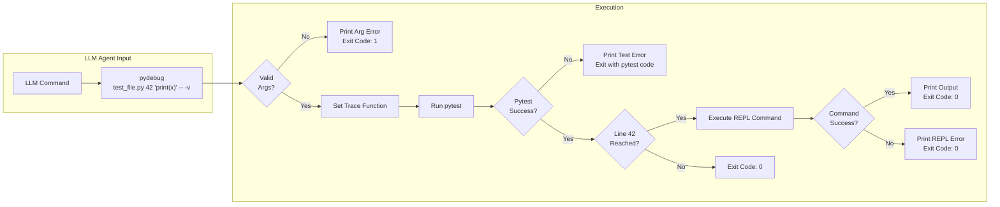

# Smart Debugger: Non-Interactive Python Debugging Tool for LLM Agents

**A Simple, Non-Interactive Debugging Tool for Python Code - Works with Both Pytest and Standalone Scripts**

## 🏗️ How It Works (Simple Flow)



## 🎯 Core Concept

This tool allows LLM agents to:
1. **Set a breakpoint** at any file:line location
2. **Execute a REPL command** when that line is reached
3. **Get the output** and exit immediately
4. **Works with both pytest tests AND standalone Python scripts**

**No interaction. No complex analysis. Just execute and exit.**

## 🤖 Best Practices for LLM Agents

### Always Use File Parameter Method with Quiet Mode

**IMPORTANT**: LLM agents should **always use the file parameter method (`-f` or `--file`) with `--quiet` mode** as the default approach.

#### Why File Parameter Method + Quiet Mode?
- **Separation of concerns** - Debug code separate from shell commands
- **Reusable debug scripts** - Save and reuse complex debugging logic
- **No escaping issues** - Write Python naturally without shell quoting
- **Reduces output by 90%+** - Essential for staying within LLM context limits
- **Clean, parseable output** - Ideal for automated analysis
- **Better for production debugging** - Debug production code through tests
- **Saves valuable tokens** - More room for actual problem-solving

#### When to Use Normal Mode
- Only when debugging test failures that require full pytest output
- When specifically asked to show pytest session details
- When troubleshooting the debugger itself

### Context Efficiency Examples

```bash
# ✅ MOST PREFERRED: File parameter method with quiet mode (saves ~90% context)
cat > /tmp/debug.py << 'EOF'
print(f"Variable: {variable}")
print(f"Type: {type(variable)}")
EOF
pydebug --quiet -f /tmp/debug.py test_file.py 42 -- -v
# Output: Variable: {'key': 'value'}
#         Type: <class 'dict'>

# ✅ GOOD: Stdin method with quiet mode (for medium complexity)
echo 'print(variable)' | pydebug-stdin --quiet test_file.py 42 -- -v
# Output: {'key': 'value'}

# ✅ ACCEPTABLE: Direct method with quiet mode (for simple cases)
pydebug --quiet test_file.py 42 "print(variable)" -- -v
# Output: {'key': 'value'}

# ❌ AVOID: Normal mode (wastes context)
echo 'print(variable)' | pydebug-stdin test_file.py 42 -- -v
# Output: [30+ lines of pytest output + actual value]
```

## 🚀 Quick Start

### Global Commands Available
The smart debugger is globally accessible via `pydebug` and `pydebug-stdin` commands. Both support a `--quiet` or `-q` flag for clean output, and `pydebug` supports a `-f` or `--file` parameter for file-based debugging.

### Method 1: Using file parameter with pydebug (MOST PREFERRED FOR LLMs)
```bash
# Template (with --quiet as default)
cat > /tmp/debug.py << 'EOF'
# Your debug code here
print(variable)
EOF
pydebug --quiet -f /tmp/debug.py <test_file> <line_number> -- <pytest_args>

# Simple example
cat > /tmp/debug.py << 'EOF'
print(f"x = {x}")
print(f"Type: {type(x)}")
EOF
pydebug --quiet -f /tmp/debug.py tests/test_example.py 42 -- -v

# Complex debugging for production code
cat > /tmp/debug_prod.py << 'EOF'
print("=== PRODUCTION CODE DEBUG ===")
print(f"Input: {input_data}")
print(f"Processing result: {result}")
print(f"Expected: {expected}")
print(f"Match: {result == expected}")

import json
if isinstance(result, (dict, list)):
    print("\nJSON format:")
    print(json.dumps(result, indent=2))
EOF
pydebug --quiet -f /tmp/debug_prod.py tests/test_production.py 55 -- -v
```

### Method 2: Using pydebug-stdin with echo (GOOD FOR MEDIUM COMPLEXITY)
```bash
# Template (with --quiet as default)
echo '<python_code>' | pydebug-stdin --quiet <test_file> <line_number> -- <pytest_args>

# Simple examples (all using --quiet for LLM efficiency)
echo 'print(x)' | pydebug-stdin --quiet tests/test_example.py 42 -- -v
echo 'print(type(data), len(data))' | pydebug-stdin --quiet tests/test_data.py 15 -- -v -s
echo 'print(f"result={result}")' | pydebug-stdin --quiet tests/test_calc.py 8 -- -v

# Complex multiline expressions
echo 'print(f"""
x = {x}
y = {y}
total = {x + y}
""")' | pydebug-stdin --quiet test.py 42 -- -v

# JSON formatting for complex data
echo 'import json; print(json.dumps(data, indent=2))' | pydebug-stdin --quiet test.py 42 -- -v

# Only omit --quiet when full output needed
echo 'print(x)' | pydebug-stdin tests/test_example.py 42 -- -v  # Full pytest output
```

## ⭐ Why File Parameter Method is Most Preferred for LLMs

The file parameter method (`-f` or `--file`) is the MOST recommended approach for LLM agents because:

1. **Separation of Concerns**: Debug code is separate from shell commands
2. **Reusability**: Debug scripts can be saved and reused across sessions
3. **No Escaping Issues**: Write Python naturally without worrying about shell quoting
4. **Production Debugging**: Safely debug production code through test breakpoints
5. **Complex Logic Support**: Write multi-line debugging logic with proper formatting
6. **Version Control Friendly**: Debug scripts can be tracked if needed
7. **Better Error Messages**: Python syntax errors are clearer in files

### Debugging Production Code via Tests Pattern

```bash
# Create a debug script to inspect production code behavior
cat > /tmp/debug_prod.py << 'EOF'
# This runs in the context of the test, which calls production code
print("=== PRODUCTION CODE DEBUG ===")
print(f"Function input: {input_data}")
print(f"Expected output: {expected}")
print(f"Actual output: {actual}")
print(f"Match: {expected == actual}")
if hasattr(actual, '__dict__'):
    print(f"Actual object state: {vars(actual)}")
EOF

# Debug production code behavior through test
pydebug --quiet -f /tmp/debug_prod.py tests/test_production.py 55 -- -v
```

## ⭐ When to Use Each Method

### Use File Parameter Method When:
- Debugging complex scenarios requiring multiple statements
- Need reusable debugging logic
- Debugging production code through tests
- Working with structured data analysis
- Need proper Python formatting without escaping

### Use Stdin Method When:
- Medium complexity commands (2-5 lines)
- One-off debugging without reuse needs
- Quick inspections with formatting

### Use Direct Method When:
- Simple one-line print statements
- Basic variable inspection

### Complex Examples Using File Parameter Method
```bash
# Complex debugging with structured output
cat > /tmp/debug_data.py << 'EOF'
import json
import sys

print("=== DATA STRUCTURE ANALYSIS ===")
print(f"Type: {type(data).__name__}")
print(f"Size: {sys.getsizeof(data)} bytes")

if isinstance(data, dict):
    print(f"Keys: {list(data.keys())}")
    print("\nFormatted content:")
    print(json.dumps(data, indent=2, default=str))
elif isinstance(data, list):
    print(f"Length: {len(data)}")
    print(f"First item: {data[0] if data else 'Empty list'}")
else:
    print(f"Value: {data}")
EOF

pydebug --quiet -f /tmp/debug_data.py test.py 42 -- -v

# Multiline inspection with formatted output
echo 'print(f"""
Variable Analysis:
  Type: {type(data)}
  Length: {len(data) if hasattr(data, "__len__") else "N/A"}
  Value: {data}
""")' | pydebug-stdin --quiet test.py 42 -- -v

# Complex object inspection
echo 'print("\n".join([f"{k}: {type(v)} = {v}" for k, v in locals().items() if not k.startswith("_")]))' | pydebug-stdin --quiet test.py 42 -- -v

# Graph analysis example
echo 'print(f"Graph Analysis:\n  Nodes: {graph.number_of_nodes()}\n  Edges: {graph.number_of_edges()}\n  First 3 nodes: {list(graph.nodes())[:3]}")' | pydebug-stdin --quiet test_graph.py 64 -- -v
```

### Method 3: Using pydebug directly (for simple commands only)
```bash
# Template (with --quiet as default)
pydebug --quiet <test_file> <line_number> '<python_code>' -- <pytest_args>

# Example (using --quiet for LLM efficiency)
pydebug --quiet tests/test_example.py 42 'print(x)' -- -v

# Only omit --quiet when full output needed
pydebug tests/test_example.py 42 'print(x)' -- -v  # Full pytest output
```

Note: The file parameter method shown in Method 1 is the preferred approach over using `exec(open(...).read())`.

## 🔇 Quiet Mode (Essential for LLM Agents)

**CRITICAL FOR LLM AGENTS**: Always use quiet mode by default to conserve context space!

The smart debugger supports a quiet mode that shows only the REPL output, making it ideal for LLM agents and automated use cases.

### How Quiet Mode Works

Use the `--quiet` or `-q` flag to enable quiet mode:
- Shows only the REPL command output to stdout
- Version banner and breakpoint info go to stderr
- All pytest output is suppressed
- Warnings are shown on stderr if no output was captured

### Quiet Mode vs Normal Mode

#### Normal Mode Output
```bash
$ pydebug test_example.py 42 "print(result)"
============================= test session starts ==============================
platform linux -- Python 3.11.2, pytest-8.3.3, pluggy-1.5.0
rootdir: /path/to/project
collecting ... collected 1 item

test_example.py 
=== BREAKPOINT HIT: test_example.py:42 ===
{'key': 'value'}
=== END BREAKPOINT ===

PASSED
Smart Debugger v1.2.0 - Non-interactive debugging for LLM agents
```

#### Quiet Mode Output
```bash
$ pydebug --quiet test_example.py 42 "print(result)"
{'key': 'value'}
```

With stderr visible:
```bash
$ pydebug --quiet test_example.py 42 "print(result)" 2>&1
{'key': 'value'}
Smart Debugger v1.2.0 - Non-interactive debugging for LLM agents
Breakpoint hit: test_example.py:42
```

### Quiet Mode with Global Commands

```bash
# Using pydebug with quiet mode
pydebug --quiet tests/test_example.py 42 'print(x)' -- -v

# Using pydebug-stdin with quiet mode
echo 'print(x)' | pydebug-stdin --quiet tests/test_example.py 42 -- -v
```

### Use Cases for Quiet Mode

1. **LLM Agent Debugging (PRIMARY USE CASE)**
   ```bash
   # LLM agents should ALWAYS use --quiet with file parameter method
   cat > /tmp/debug.py << 'EOF'
   print(variable)
   EOF
   pydebug --quiet -f /tmp/debug.py test.py 42
   # Saves 90%+ of output tokens vs normal mode
   ```

2. **Scripting and Automation**
   ```bash
   # Get just the value for use in a script
   value=$(pydebug --quiet test.py 42 "print(data['count'])")
   echo "Count is: $value"
   ```

3. **Piping to Other Tools**
   ```bash
   # Pipe JSON output directly to jq
   pydebug --quiet test.py 42 "import json; print(json.dumps(data))" | jq .
   ```

4. **Clean Output for Documentation**
   ```bash
   # Get clean output for examples
   pydebug --quiet test.py 42 "print(f'Result: {result}')"
   # Output: Result: 42
   ```

### Warning When No Output

If your REPL command doesn't produce any output, quiet mode will show a warning on stderr:

```bash
$ pydebug --quiet test.py 42 "x = 5"  # No print statement
$ echo $?  # Exit code is still 0
0
```

With stderr:
```bash
$ pydebug --quiet test.py 42 "x = 5" 2>&1
Smart Debugger v1.2.0 - Non-interactive debugging for LLM agents
Breakpoint hit: test.py:42
Warning: No output captured from REPL command
```

## 📋 Common Usage Patterns

### Inspect Variable Value
```bash
# Most preferred for LLM agents (file method + quiet mode)
cat > /tmp/debug_user.py << 'EOF'
print(f"User data: {user_data}")
print(f"Data type: {type(user_data).__name__}")
if hasattr(user_data, 'id'):
    print(f"User ID: {user_data.id}")
EOF
pydebug --quiet -f /tmp/debug_user.py tests/test_user.py 25 -- -v

# Good for medium complexity (stdin method + quiet mode)
echo 'print(user_data)' | pydebug-stdin --quiet tests/test_user.py 25 -- -v

# Complex variable inspection
echo 'print(f"User data type: {type(user_data)}, keys: {list(user_data.keys()) if hasattr(user_data, "keys") else "N/A"}")' | pydebug-stdin --quiet tests/test_user.py 25 -- -v

# Only when full pytest output needed
echo 'print(user_data)' | pydebug-stdin tests/test_user.py 25 -- -v
```

### Check Type and Length
```bash
# Most preferred for LLM agents (file method + quiet mode)
cat > /tmp/debug_items.py << 'EOF'
print(f"Type: {type(items).__name__}")
print(f"Length: {len(items)}")
if items:
    print(f"First item: {items[0]}")
    print(f"Last item: {items[-1]}")
EOF
pydebug --quiet -f /tmp/debug_items.py tests/test_list.py 30 -- -v

# Good for simple checks (stdin method + quiet mode)
echo 'print(type(items), len(items))' | pydebug-stdin --quiet tests/test_list.py 30 -- -v

# Detailed analysis with formatting
echo 'print(f"Items: {type(items).__name__} with {len(items)} elements")' | pydebug-stdin --quiet tests/test_list.py 30 -- -v
```

### Evaluate Expression
```bash
# Most preferred for LLM agents (file method + quiet mode)
cat > /tmp/debug_math.py << 'EOF'
print(f"x = {x}")
print(f"y = {y}")
print(f"Sum: {x + y}")
print(f"Product: {x * y}")
print(f"Division: {x / y if y != 0 else 'Division by zero'}")
EOF
pydebug --quiet -f /tmp/debug_math.py tests/test_math.py 18 -- -v

# Good for simple evaluations (stdin method + quiet mode)
echo 'print(x + y)' | pydebug-stdin --quiet tests/test_math.py 18 -- -v

# Complex mathematical evaluation
echo 'print(f"x={x}, y={y}, sum={x+y}, product={x*y}")' | pydebug-stdin --quiet tests/test_math.py 18 -- -v

# Capturing result for further processing
result=$(echo 'print(x + y)' | pydebug-stdin --quiet tests/test_math.py 18 -- -v)
```

### Access Object Attributes
```bash
# Most preferred for LLM agents (file method + quiet mode)
cat > /tmp/debug_model.py << 'EOF'
print("=== MODEL DEBUG ===")
print(f"Name: {model.name}")
print(f"Status: {model.status}")
print(f"Type: {type(model).__name__}")
print(f"Attributes: {[attr for attr in dir(model) if not attr.startswith('_')][:10]}")
EOF
pydebug --quiet -f /tmp/debug_model.py tests/test_model.py 45 -- -v

# Good for simple access (stdin method + quiet mode)
echo 'print(model.name, model.status)' | pydebug-stdin --quiet tests/test_model.py 45 -- -v

# Structured output for parsing
echo 'print(f"{model.name}|{model.status}")' | pydebug-stdin --quiet tests/test_model.py 45 -- -v

# Detailed object inspection with multiline output
echo 'print(f"""
Model Details:
  Name: {model.name}
  Status: {model.status}
  Type: {type(model)}
  Attributes: {[attr for attr in dir(model) if not attr.startswith("_")]}
""")' | pydebug-stdin --quiet tests/test_model.py 45 -- -v
```

### Multiple Statements with Semicolons
```bash
# Most preferred for LLM agents (file method + quiet mode)
cat > /tmp/debug_json.py << 'EOF'
import json
print("=== JSON DATA ===")
print(f"Data type: {type(data).__name__}")
print(f"Size: {len(str(data))} chars")
print("\nFormatted JSON:")
print(json.dumps(data, indent=2, default=str))
EOF
pydebug --quiet -f /tmp/debug_json.py tests/test_data.py 22 -- -v

# Good for quick JSON output (stdin method + quiet mode)
echo 'import json; print(json.dumps(data, indent=2))' | pydebug-stdin --quiet tests/test_data.py 22 -- -v

# Complex multi-statement analysis
echo 'import json; formatted = json.dumps(data, indent=2); print(f"Data size: {len(str(data))} chars\nFormatted:\n{formatted}")' | pydebug-stdin --quiet tests/test_data.py 22 -- -v
```

### Real-World Complex Debugging Examples
```bash
# Graph debugging with comprehensive output
echo 'print(f"""
=== GRAPH DEBUG ===
Type: {type(graph)}
Nodes: {graph.number_of_nodes()}
Edges: {graph.number_of_edges()}
First 5 nodes: {list(graph.nodes())[:5]}
Node types: {set(graph.nodes[n].get("type", "unknown") for n in list(graph.nodes())[:10])}
""")' | pydebug-stdin --quiet tests/test_integration.py 64 -- -k test_name -xvs --tb=no

# Database result analysis
echo 'print(f"""
=== QUERY RESULTS ===
Result type: {type(results)}
Count: {len(results) if hasattr(results, "__len__") else "N/A"}
First result: {results[0] if results else "No results"}
Columns: {list(results[0].keys()) if results and hasattr(results[0], "keys") else "N/A"}
""")' | pydebug-stdin --quiet tests/test_db.py 30 -- -v

# API response debugging
echo 'import json; print(f"Status: {response.status_code}\nHeaders: {dict(response.headers)}\nBody: {json.dumps(response.json(), indent=2) if response.headers.get("content-type", "").startswith("application/json") else response.text[:200]}")' | pydebug-stdin --quiet tests/test_api.py 45 -- -v
```

## 🤖 For LLM Agents (Critical Information)

### ALWAYS Use File Parameter Method with Quiet Mode

**IMPORTANT**: As an LLM agent, you should **always use the file parameter method (`-f`) with `--quiet` mode** as your default approach:

```bash
# ✅ MOST PREFERRED (file method + saves 90%+ context)
cat > /tmp/debug.py << 'EOF'
print(f"Variable: {variable}")
print(f"Type: {type(variable)}")
EOF
pydebug --quiet -f /tmp/debug.py test_file.py 42 -- -v

# ✅ GOOD (stdin for medium complexity)
echo 'print(variable)' | pydebug-stdin --quiet test_file.py 42 -- -v

# ✅ ACCEPTABLE (direct for simple cases)
pydebug --quiet test_file.py 42 "print(variable)" -- -v

# ❌ AVOID THIS (wastes valuable context)
echo 'print(data)' | pydebug-stdin test.py 10 -- -v
pydebug test_file.py 42 "print(variable)" -- -v
```

### Why File Parameter Method is Superior for LLMs

1. **Separation of Concerns**: Debug logic separate from shell commands
2. **Reusable Debug Scripts**: Save and reuse complex debugging patterns
3. **Natural Python Writing**: No shell escaping or quoting issues
4. **Production Code Debugging**: Safely debug production through test contexts
5. **Complex Logic Support**: Multi-line debugging with proper structure
6. **Better Error Handling**: Clear Python syntax errors
7. **Predictable Execution**: Most reliable method for automation

### What This Tool Does
- Sets a breakpoint at the specified line
- Runs pytest until that line is reached
- Executes your REPL command in that context
- Prints the output
- Exits

### What This Tool Doesn't Do
- No interactive prompts
- No waiting for user input
- No complex object analysis
- No special commands

### Output Format

#### Success Case
```
=== BREAKPOINT HIT: /path/to/test_file.py:42 ===
<your command output here>
=== END BREAKPOINT ===
```

#### Error Case
```
=== BREAKPOINT HIT: /path/to/test_file.py:42 ===
ERROR: NameError: name 'undefined_var' is not defined
=== END BREAKPOINT ===
```

## 🛠️ Installation

The debugger is already installed and globally accessible. No additional setup needed!

```bash
# Test that it's working
echo 'print("Hello from debugger!")' | pydebug-stdin --help
```

## 📚 Examples

### Example 1: Debug Test Failure
```bash
# Most preferred approach for LLM agents (file method + quiet mode)
cat > /tmp/debug_auth.py << 'EOF'
print("=== AUTHENTICATION DEBUG ===")
print(f"Token: {token}")
print(f"Token type: {type(token).__name__}")
print(f"User: {user}")
if isinstance(user, dict):
    print(f"User ID: {user.get('id')}")
    print(f"User name: {user.get('name')}")
EOF
pydebug --quiet -f /tmp/debug_auth.py tests/test_auth.py 15 -- -v
# Output:
# === AUTHENTICATION DEBUG ===
# Token: None
# Token type: NoneType
# User: {'id': 123, 'name': 'test'}
# User ID: 123
# User name: test

# Good for quick inspection (stdin method + quiet mode)
echo 'print(f"token={token}, user={user}")' | pydebug-stdin --quiet tests/test_auth.py 15 -- -v
# Output:
# token=None, user={'id': 123, 'name': 'test'}

# Enhanced debugging with multiline formatting
echo 'print(f"""
Authentication Debug:
  Token: {token}
  User: {user}
  Token type: {type(token)}
  User keys: {list(user.keys()) if isinstance(user, dict) else "Not a dict"}
""")' | pydebug-stdin --quiet tests/test_auth.py 15 -- -v

# Only use normal mode when pytest output is specifically needed
echo 'print(f"token={token}, user={user}")' | pydebug-stdin tests/test_auth.py 15 -- -v
# Output:
# === BREAKPOINT HIT: tests/test_auth.py:15 ===
# token=None, user={'id': 123, 'name': 'test'}
# === END BREAKPOINT ===
# [Plus 20+ lines of pytest output]
```

### Example 2: Check Data Structure
```bash
# Most preferred approach for LLM agents (file method + quiet mode)
cat > /tmp/debug_parser.py << 'EOF'
import json
print("=== PARSED DATA STRUCTURE ===")
print(f"Type: {type(parsed_data).__name__}")
print(f"Keys: {list(parsed_data.keys())}")
print("\nDetailed analysis:")
for key, value in parsed_data.items():
    print(f"  {key}: {type(value).__name__} (size: {len(str(value))} chars)")
EOF
pydebug --quiet -f /tmp/debug_parser.py tests/test_parser.py 30 -- -v
# Output:
# === PARSED DATA STRUCTURE ===
# Type: dict
# Keys: ['header', 'body', 'footer']
# 
# Detailed analysis:
#   header: str (size: 45 chars)
#   body: dict (size: 234 chars)
#   footer: str (size: 67 chars)

# Good for quick checks (stdin method + quiet mode)
echo 'print(list(parsed_data.keys()))' | pydebug-stdin --quiet tests/test_parser.py 30 -- -v
# Output:
# ['header', 'body', 'footer']

# Enhanced data structure analysis
echo 'import json; print(json.dumps({"keys": list(parsed_data.keys()), "types": {k: str(type(v)) for k, v in parsed_data.items()}, "sizes": {k: len(str(v)) for k, v in parsed_data.items()}}, indent=2))' | pydebug-stdin --quiet tests/test_parser.py 30 -- -v
```

### Example 3: Complex REPL Command
```bash
# Most preferred approach for LLM agents (file method + quiet mode)
cat > /tmp/debug_response.py << 'EOF'
import json
print("=== API RESPONSE ANALYSIS ===")
for k, v in response.items():
    print(f"{k}: {type(v).__name__}")
    if isinstance(v, (str, int, float, bool)):
        print(f"  Value: {v}")
    elif isinstance(v, (list, dict)):
        print(f"  Length: {len(v)}")
        if v and isinstance(v, list):
            print(f"  First item type: {type(v[0]).__name__}")
EOF
pydebug --quiet -f /tmp/debug_response.py tests/test_api.py 48 -- -v

# Good for type inspection (stdin method + quiet mode)
echo 'for k, v in response.items(): print(f"{k}: {type(v)}")' | pydebug-stdin --quiet tests/test_api.py 48 -- -v
# Output:
# status: <class 'int'>
# data: <class 'dict'>
# errors: <class 'list'>

# Advanced response analysis with JSON formatting
echo 'import json; analysis = {"response_structure": {k: {"type": str(type(v)), "sample": str(v)[:50] + "..." if len(str(v)) > 50 else str(v)} for k, v in response.items()}}; print(json.dumps(analysis, indent=2))' | pydebug-stdin --quiet tests/test_api.py 48 -- -v
```

### Example 4: Real-World NetworkX Graph Debugging
```bash
# Most preferred approach for LLM agents (file method + quiet mode saves ~95% context)
cat > /tmp/debug_graph.py << 'EOF'
print("=== GRAPH DEBUG ===")
print(f"Type: {type(graph).__name__}")
print(f"Nodes: {graph.number_of_nodes()}")
print(f"Edges: {graph.number_of_edges()}")
print(f"First 5 nodes: {list(graph.nodes())[:5]}")

# Node analysis
node_data = dict(list(graph.nodes(data=True))[:3])
print("\nSample node data:")
for node, attrs in node_data.items():
    print(f"  {node}: {attrs}")

# Edge analysis  
edge_data = list(graph.edges(data=True))[:3]
print("\nSample edge data:")
for u, v, attrs in edge_data:
    print(f"  {u} -> {v}: {attrs}")
EOF
pydebug --quiet -f /tmp/debug_graph.py tests/test_smart_content/test_integration_pipeline.py 64 -- -k test_complete_pipeline_with_real_llm -xvs --tb=no

# Good for quick graph stats (stdin method + quiet mode)
echo 'print(f"""
=== GRAPH DEBUG ===
Type: {type(graph)}
Nodes: {graph.number_of_nodes()}
Edges: {graph.number_of_edges()}
First 5 nodes: {list(graph.nodes())[:5]}
Sample node data: {dict(list(graph.nodes(data=True))[:3])}
Sample edge data: {list(graph.edges(data=True))[:3]}
""")' | pydebug-stdin --quiet tests/test_smart_content/test_integration_pipeline.py 64 -- -k test_complete_pipeline_with_real_llm -xvs --tb=no

# Automated graph analysis (always use stdin method + quiet mode)
nodes=$(echo 'print(graph.number_of_nodes())' | pydebug-stdin --quiet tests/test_smart_content/test_integration_pipeline.py 64 -- -k test_complete_pipeline_with_real_llm -xvs --tb=no)
echo "Graph has $nodes nodes"

# Complex graph relationship analysis
echo 'node_types = {}; edge_types = {}; [node_types.setdefault(graph.nodes[n].get("type", "unknown"), 0).__iadd__(1) for n in graph.nodes()]; [edge_types.setdefault(data.get("type", "unknown"), 0).__iadd__(1) for u, v, data in graph.edges(data=True)]; print(f"Node types: {dict(node_types)}\nEdge types: {dict(edge_types)}")' | pydebug-stdin --quiet tests/test_integration.py 64 -- -k test_name -xvs --tb=no
```

### Example 5: Database and API Debugging
```bash
# Database query results analysis
echo 'print(f"""
=== DATABASE RESULTS ===
Query returned: {len(results)} rows
Column names: {list(results[0].keys()) if results and hasattr(results[0], "keys") else "No columns"}
First row: {dict(results[0]) if results else "No data"}
Data types: {[type(r).__name__ for r in results[:3]] if results else "No types"}
""")' | pydebug-stdin --quiet tests/test_database.py 25 -- -v

# API response comprehensive analysis
echo 'import json; content_type = response.headers.get("content-type", ""); is_json = "json" in content_type; data = response.json() if is_json else response.text[:200]; print(f"Status: {response.status_code}\nContent-Type: {content_type}\nData: {json.dumps(data, indent=2) if is_json else data}")' | pydebug-stdin --quiet tests/test_api.py 35 -- -v
```

## ⚠️ Important Notes

1. **File must exist** - The tool validates the file path
2. **Line must be valid** - Must be within the file's line count
3. **Command is Python** - Any valid Python expression or statement
4. **Output to stdout** - Use `print()` to see values
5. **Exits immediately** - No interaction after command execution

## 💡 Debugging Loops

**Important:** This tool stops at the FIRST time a line is hit and cannot continue to subsequent iterations.

If you need to debug a specific iteration of a loop, temporarily edit the target file to add a conditional breakpoint:

```python
# Original code:
for i, item in enumerate(items):
    process(item)  # Line 42 - Want to debug when i == 5

# Temporary edit for debugging:
for i, item in enumerate(items):
    if i == 5:  # Add condition
        process(item)  # Line 43 - Set breakpoint here
    else:
        process(item)
```

Then run:
```bash
# Always use quiet mode for LLM efficiency
echo 'print(f"item={item}, i={i}")' | pydebug-stdin --quiet test_file.py 43 -- -v
```

Remember to revert your temporary edit after debugging!

## 🚫 What NOT to Do

```bash
# DON'T use interactive debugger commands
echo 'n' | pydebug-stdin test.py 10 -- -v  # ❌ Won't work

# DON'T expect a prompt
echo '' | pydebug-stdin test.py 10 -- -v   # ❌ Will just exit

# DON'T use special debugger commands
echo 'where' | pydebug-stdin test.py 10 -- -v  # ❌ Not a REPL command

# DON'T split echo commands across lines without escaping
echo 'print("line1")
print("line2")' | pydebug-stdin test.py 10 -- -v  # ❌ Shell will be confused
```

## ✅ What TO Do

```bash
# DO always use file parameter method with --quiet mode for LLM efficiency
cat > /tmp/debug.py << 'EOF'
print(variable)
EOF
pydebug --quiet -f /tmp/debug.py test.py 10 -- -v  # ✅ MOST PREFERRED

# DO use stdin method for medium complexity with --quiet mode
echo 'print(variable)' | pydebug-stdin --quiet test.py 10 -- -v  # ✅ GOOD

# DO use Python expressions with file method + quiet mode
cat > /tmp/debug.py << 'EOF'
print(2 + 2)
EOF
pydebug --quiet -f /tmp/debug.py test.py 10 -- -v  # ✅ MOST PREFERRED

# DO access any variable in scope with file method + quiet mode
cat > /tmp/debug.py << 'EOF'
import pprint
print("=== LOCAL VARIABLES ===")
pprint.pprint({k: v for k, v in locals().items() if not k.startswith('_')})
EOF
pydebug --quiet -f /tmp/debug.py test.py 10 -- -v  # ✅ MOST PREFERRED

# DO use complex multiline expressions with file method
cat > /tmp/debug.py << 'EOF'
print("""Debug Info:
  x = {}
  y = {}
  sum = {}""".format(x, y, x + y))
EOF
pydebug --quiet -f /tmp/debug.py test.py 10 -- -v  # ✅ MOST PREFERRED

# DO use JSON formatting for complex data with file method
cat > /tmp/debug.py << 'EOF'
import json
print("=== JSON DATA ===")
print(json.dumps(data, indent=2, default=str))
EOF
pydebug --quiet -f /tmp/debug.py test.py 10 -- -v  # ✅ MOST PREFERRED

# DO use stdin method for medium complexity
echo 'print(f"x={x}, y={y}")' | pydebug-stdin --quiet test.py 10 -- -v  # ✅ GOOD

# DO use direct method for simple cases only
pydebug --quiet test.py 10 "print(variable)" -- -v  # ✅ ACCEPTABLE
```

## 🎯 Summary

This is a simple tool that:
- Takes a file, line number, and REPL command
- Runs the command when that line is reached
- Prints the output
- Exits

That's it. No complexity. No interaction. Just execute and exit.

## 🚀 Standalone Python Debugging (NEW)

**The Smart Debugger now supports debugging ANY Python file, not just pytest tests!** This makes it a universal Python debugging tool for LLM agents.

### Overview

The standalone mode allows you to:
- Debug any Python script without pytest
- Debug Python modules using `-m` flag
- Pass command-line arguments to your script
- Set breakpoints in any Python file execution
- Get clean output with `--quiet` mode

### Mode Selection

The debugger automatically detects the mode based on your usage:
- **Pytest mode** (default): When debugging test files or using pytest flags
- **Standalone mode**: When using `--mode standalone` or `-m` flag

### Basic Standalone Usage

```bash
# Debug a standalone script (always use --quiet for LLM efficiency)
echo 'print(variables)' | pydebug-stdin --quiet --mode standalone script.py 42

# Using direct method (for simple commands)
pydebug --quiet --mode standalone script.py 42 "print(data)"

# Debug a Python module
echo 'print(state)' | pydebug-stdin --quiet -m mymodule 50

# Pass arguments to your script/module
echo 'print(sys.argv)' | pydebug-stdin --quiet --mode standalone script.py 10 -- arg1 arg2 arg3
```

### Standalone Mode Examples

#### Example 1: Debug a Simple Script
```bash
# script.py:
# def process_data(input_file):
#     data = load_file(input_file)  # Line 10
#     result = transform(data)
#     return result

# Debug to see what's in 'data'
echo 'print(f"data type: {type(data)}, size: {len(data)}")' | pydebug-stdin --quiet --mode standalone script.py 10 -- input.csv
```

#### Example 2: Debug a Module
```bash
# Debug a module execution
echo 'print(config)' | pydebug-stdin --quiet -m myapp.main 25

# With module arguments
echo 'print(f"Args: {args}, Config: {config}")' | pydebug-stdin --quiet -m myapp.main 25 -- --config prod.yaml
```

#### Example 3: Complex Standalone Debugging
```bash
# Debug a data processing script with detailed inspection
echo 'print(f"""
=== DATA PROCESSING DEBUG ===
Input file: {input_file}
Data shape: {data.shape if hasattr(data, "shape") else len(data)}
Data type: {type(data)}
First item: {data[0] if data else "No data"}
Memory usage: {sys.getsizeof(data) / 1024 / 1024:.2f} MB
""")' | pydebug-stdin --quiet --mode standalone process_data.py 45 -- large_dataset.csv
```

#### Example 4: Debug Web Application
```bash
# Debug a Flask/FastAPI application
echo 'print(f"Request: {request.method} {request.path}, Headers: {dict(request.headers)}")' | pydebug-stdin --quiet -m flask run 30

# Debug API endpoint
echo 'import json; print(json.dumps({"endpoint": endpoint, "params": params, "user": current_user.id if current_user else None}, indent=2))' | pydebug-stdin --quiet --mode standalone app.py 75
```

#### Example 5: Debug Data Science Scripts
```bash
# Debug pandas operations
echo 'print(f"""
DataFrame Info:
  Shape: {df.shape}
  Columns: {list(df.columns)}
  Dtypes: {df.dtypes.to_dict()}
  Missing values: {df.isnull().sum().to_dict()}
  First 3 rows:\n{df.head(3)}
""")' | pydebug-stdin --quiet --mode standalone analysis.py 120 -- sales_data.csv

# Debug machine learning model
echo 'print(f"Model: {type(model).__name__}, Features: {model.n_features_}, Score: {model.score(X_test, y_test):.4f}")' | pydebug-stdin --quiet --mode standalone train_model.py 85 -- --model-type rf
```

### Command-Line Arguments in Standalone Mode

When debugging standalone scripts, arguments after `--` are passed to your script:

```bash
# Your script sees: sys.argv = ['script.py', 'input.txt', '--verbose']
echo 'print(sys.argv)' | pydebug-stdin --quiet --mode standalone script.py 10 -- input.txt --verbose

# Module with arguments
echo 'print(sys.argv)' | pydebug-stdin --quiet -m mymodule 20 -- --config prod.yaml --debug
```

### Standalone vs Pytest Mode

#### When to Use Standalone Mode
- Debugging regular Python scripts
- Debugging modules (`-m` flag)
- Debugging applications (web apps, CLI tools, etc.)
- When you need to pass arguments to your script
- Debugging data processing or analysis scripts

#### When to Use Pytest Mode (Default)
- Debugging test files
- When you need pytest-specific features
- When running with pytest flags (-k, -v, -s, etc.)

### Advanced Standalone Examples

#### Debug with Environment Inspection
```bash
# Check environment and configuration
echo 'import os; print(f"""
Environment Debug:
  Python: {sys.version}
  CWD: {os.getcwd()}
  PATH: {os.environ.get("PATH", "Not set")}
  Config: {config if "config" in locals() else "Not loaded"}
  Modules: {list(sys.modules.keys())[:10]}
""")' | pydebug-stdin --quiet --mode standalone app.py 15
```

#### Debug Exception Context
```bash
# When debugging near an exception
echo 'print(f"""
Exception Context:
  Locals: {list(locals().keys())}
  Error var: {error if "error" in locals() else "No error"}
  Traceback: {traceback.format_exc() if "traceback" in sys.modules else "No traceback"}
""")' | pydebug-stdin --quiet --mode standalone script.py 50
```

#### Debug Performance Issues
```bash
# Profile code execution
echo 'import time; start = time.time(); print(f"""
Performance Debug:
  Function: {func.__name__ if "func" in locals() else "Unknown"}
  Args: {args if "args" in locals() else "None"}
  Data size: {len(data) if "data" in locals() and hasattr(data, "__len__") else "N/A"}
  Execution point: {time.time() - start:.3f}s since start
""")' | pydebug-stdin --quiet --mode standalone slow_script.py 100
```

### Tips for Standalone Debugging

1. **Always use `--quiet` mode**: Essential for LLM agents to reduce output
2. **Use `--mode standalone` explicitly**: Makes intent clear when debugging non-test files
3. **Module debugging with `-m`**: Automatically uses standalone mode
4. **Pass arguments with `--`**: Everything after `--` goes to your script
5. **Inspect sys.argv**: Useful to verify arguments are passed correctly
6. **Check module paths**: Use `sys.path` to debug import issues
7. **Environment variables**: Inspect `os.environ` for configuration issues

### Common Standalone Debugging Patterns

```bash
# Pattern 1: Quick variable inspection (file method - MOST PREFERRED)
cat > /tmp/debug.py << 'EOF'
print(f"Variable: {variable_name}")
print(f"Type: {type(variable_name).__name__}")
EOF
pydebug --quiet -f /tmp/debug.py --mode standalone script.py 42

# Pattern 2: Detailed state analysis (file method - MOST PREFERRED)
cat > /tmp/debug.py << 'EOF'
import pprint
print("=== LOCAL STATE ===")
pprint.pprint({k: v for k, v in locals().items() if not k.startswith('_')})
EOF
pydebug --quiet -f /tmp/debug.py --mode standalone script.py 42

# Pattern 3: Data structure debugging (file method - MOST PREFERRED)
cat > /tmp/debug.py << 'EOF'
import json
print("=== DATA STRUCTURE ===")
print(json.dumps(data, indent=2, default=str))
EOF
pydebug --quiet -f /tmp/debug.py --mode standalone script.py 42

# Pattern 4: Module execution debugging (stdin method - acceptable for simple cases)
echo 'print(f"Module: {__name__}, Package: {__package__}")' | pydebug-stdin --quiet -m package.module 10

# Pattern 5: Script with complex arguments (stdin method - acceptable for simple cases)
echo 'print(f"Args: {sys.argv[1:]}")' | pydebug-stdin --quiet --mode standalone cli_tool.py 20 -- --input data.csv --output result.json --verbose
```

## 📋 Command Examples Reference

### Basic Single Line Commands
```bash
# Inspect a single variable (always use --quiet for LLM efficiency)
echo 'print(graph.number_of_nodes())' | pydebug-stdin --quiet tests/test_integration.py 64 -- -xvs

# Check multiple values (always use --quiet for LLM efficiency)
echo 'print(f"Graph has {graph.number_of_nodes()} nodes and {graph.number_of_edges()} edges")' | pydebug-stdin --quiet tests/test_integration.py 64 -- -xvs
```

### Multiple Statements with Semicolons
```bash
# Always use --quiet for LLM efficiency
echo 'print("=== GRAPH DEBUG ==="); print("Graph type:", type(graph)); print("Nodes:", graph.number_of_nodes()); print("Edges:", graph.number_of_edges()); print("First 5 nodes:", list(graph.nodes())[:5])' | pydebug-stdin --quiet tests/test_integration.py 64 -- -k test_name -xvs --tb=no
```

### Complex Multiline Debugging
```bash
# Create a debug script for complex analysis
cat > /tmp/debug_graph.py << 'EOF'
print("=== DETAILED GRAPH INSPECTION ===")
print(f"Graph type: {type(graph)}")
print(f"Total nodes: {graph.number_of_nodes()}")
print(f"Total edges: {graph.number_of_edges()}")
print("\nNode types:")
for node in list(graph.nodes())[:10]:
    node_data = graph.nodes[node]
    print(f"  {node}: {node_data.get('type', 'unknown')}")
print("\nEdge types:")
for u, v, data in list(graph.edges(data=True))[:10]:
    print(f"  {u} -> {v}: {data.get('type', 'unknown')}")
EOF

# Always use --quiet for LLM efficiency
pydebug --quiet tests/test_integration.py 64 "exec(open('/tmp/debug_graph.py').read())" -- -k test_name -xvs --tb=no
```

### Common pytest Flags
- `-k test_name`: Run only tests matching the pattern
- `-xvs`: Exit on first failure, verbose output, no capture
- `--tb=no`: Don't show tracebacks
- `-s`: No output capture (show prints)
- `-v`: Verbose output

### Tips for Usage
1. **ALWAYS use file parameter method with --quiet mode**: Essential for LLM agents - best separation of concerns and reliability
2. **For complex debugging**: Use `pydebug --quiet -f /tmp/debug.py` for structured, reusable debug scripts
3. **For medium complexity**: Use stdin method `echo 'command' | pydebug-stdin --quiet`
4. **For simple one-liners**: Use direct method `pydebug --quiet test.py 42 "print(x)"`
5. **Write natural Python**: File parameter method lets you write Python without shell escaping
6. **Leverage structured output**: File method makes it easy to format complex debug output
7. **JSON formatting**: Perfect for complex data structures with file method
8. **Context efficiency**: File method + quiet mode reduces output by 90%+ while providing maximum debugging capability
9. **Debug production via tests**: File method is safest for debugging production code through test contexts
10. **Reusable debug scripts**: File method allows saving and reusing debug logic
11. **Use --mode standalone**: When debugging non-test Python files
12. **Use -m flag**: For debugging Python modules directly